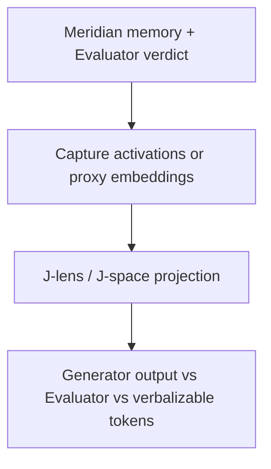

# meridian-jspace

Instruments Meridian’s three-tier memory and Evaluator reject path with a Jacobian-lens / J-space readout so a human can see *why* a gate fired.

**Status:** Scaffolding – Phase 0

Built on Meridian’s gate + independent Evaluator contracts. This is the research-adjacent differentiator in the family, not a replacement for the harness.

## Relation to Meridian

Meridian already stores semantic / episodic / corrections memory and Evaluator verdicts. This repo adds an instrumentation layer and visualization. Prefer extending those contracts over copying memory files.

## Shared contracts

- [GATE_CONTRACT.md](https://github.com/PCSchmidt/portfolio-kit/blob/main/docs/GATE_CONTRACT.md)
- [EVAL_RUBRIC_TEMPLATE.md](https://github.com/PCSchmidt/portfolio-kit/blob/main/docs/EVAL_RUBRIC_TEMPLATE.md)
- [MEMORY_SCHEMA.md](https://github.com/PCSchmidt/portfolio-kit/blob/main/docs/MEMORY_SCHEMA.md)
- [DATA_POLICY.md](https://github.com/PCSchmidt/portfolio-kit/blob/main/docs/DATA_POLICY.md)

## Architecture

Reference: Anthropic `jacobian-lens` (Apache-2.0) on a small open-weight model (Qwen family).

## Planned phases

1. Run jacobian-lens on a small Qwen checkpoint
2. Instrument Evaluator reject path (activations or embedding proxy)
3. Map rejection reasons into J-space concepts
4. Simple visualization (layer × position or top-k tokens)
5. Controlled inject-bad-output experiments + faithfulness eval
6. Short technical note

## Public / unclassified data only

Prompts and rejected outputs used in experiments must be synthetic or from public fixtures.

## Current tree

Phase 0 is documentation only.
