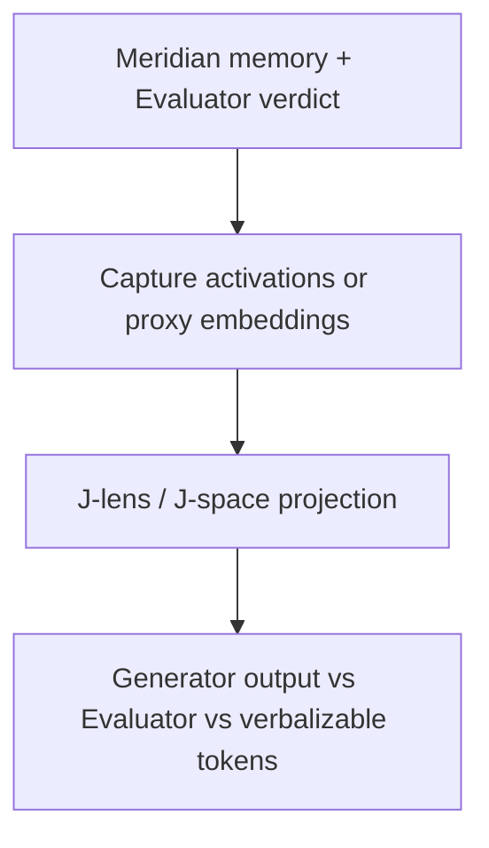

# meridian-jspace

Instruments Meridian’s three-tier memory and Evaluator reject path with a Jacobian-lens / J-space readout so a human can see *why* a gate fired.

**Status:** Phase 1 — mechanical J-space readout

Built on Meridian’s gate + independent Evaluator contracts. Phase 1 is a mechanical projector (issue codes → concept tokens). It does not download Qwen or fit jacobian-lens. This is the research-adjacent differentiator in the family, not a replacement for the harness.

## Relation to Meridian

Meridian already stores semantic / episodic / corrections memory and Evaluator verdicts. This repo adds an instrumentation layer and visualization. Prefer extending those contracts over copying memory files.

## Shared contracts

- [GATE_CONTRACT.md](https://github.com/PCSchmidt/portfolio-kit/blob/main/docs/GATE_CONTRACT.md)
- [EVAL_RUBRIC_TEMPLATE.md](https://github.com/PCSchmidt/portfolio-kit/blob/main/docs/EVAL_RUBRIC_TEMPLATE.md)
- [MEMORY_SCHEMA.md](https://github.com/PCSchmidt/portfolio-kit/blob/main/docs/MEMORY_SCHEMA.md)
- [DATA_POLICY.md](https://github.com/PCSchmidt/portfolio-kit/blob/main/docs/DATA_POLICY.md)

## Architecture



Phase 1 uses a mechanical proxy for `Cap`/`JL` (issue codes as tokens). Live Anthropic [jacobian-lens](https://github.com/anthropics/jacobian-lens) (Apache-2.0) on a small Qwen checkpoint is Phase 2.

## Develop

```sh
npm test
npm run eval
npm run project -- fixtures/reject-stub.json
```

Requires Node.js 20+. No dependencies, no network, no GPU. `--qwen`, `--download-model`, `--jacobian-lens`, `--github-write`, `--comment`, and `--issue` are refused.

## Planned phases

1. Mechanical J-space readout of Evaluator rejects *(this increment)*
2. Instrument Evaluator reject path (optional tiny open-weight / jacobian-lens)
3. Map rejection reasons into fitted J-space concepts
4. Simple visualization (layer × position or top-k tokens)
5. Controlled inject-bad-output experiments + faithfulness eval
6. Short technical note

## Public / unclassified data only

Prompts and rejected outputs used in experiments must be synthetic or from public fixtures. No employer or program-of-record trees.

## Current tree

```
CONTRACT.md
SPEC.md
src/project.js
src/concepts.js
eval/cases.json
fixtures/reject-stub.json
tests/
```
